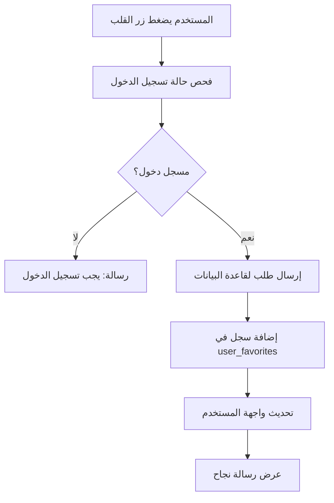
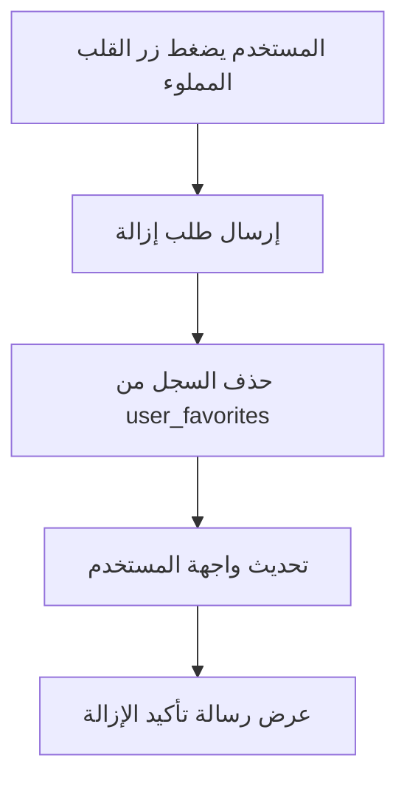
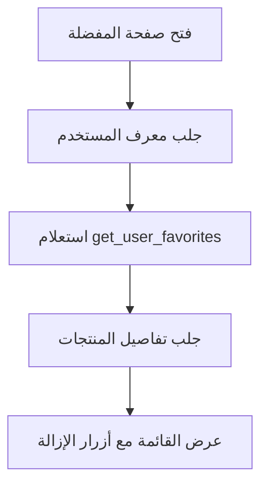

# نظام المنتجات المفضلة - ولكارد

## المقدمة

تم تطوير نظام متكامل للمنتجات المفضلة يسمح للمستخدمين بحفظ المنتجات التي يهتمون بها والوصول إليها بسهولة.

## المكونات الرئيسية

### 1. قاعدة البيانات (`favorites-system-setup.sql`)

#### جدول `user_favorites`:
```sql
CREATE TABLE user_favorites (
    id UUID PRIMARY KEY,
    user_id UUID REFERENCES users(id),
    product_id UUID REFERENCES products(id),
    created_at TIMESTAMPTZ DEFAULT NOW(),
    UNIQUE(user_id, product_id)
);
```

#### الدوال المتاحة:
- `add_to_favorites(user_id, product_id)` - إضافة منتج للمفضلة
- `remove_from_favorites(user_id, product_id)` - إزالة منتج من المفضلة
- `toggle_favorite(user_id, product_id)` - تبديل حالة المفضلة
- `get_user_favorites(user_id)` - جلب منتجات المستخدم المفضلة
- `is_product_favorite(user_id, product_id)` - فحص إذا كان المنتج مفضل
- `get_favorites_count(user_id)` - عدد المنتجات المفضلة

### 2. مدير المفضلة (`lib/favorites-manager.ts`)

#### الميزات:
- ✅ **إدارة شاملة**: إضافة، حذف، تبديل حالة المفضلة
- ✅ **فحص الحالة**: التحقق من كون المنتج مفضل أم لا
- ✅ **جلب البيانات**: استرجاع قائمة المنتجات المفضلة
- ✅ **إحصائيات**: عدد المنتجات المفضلة
- ✅ **أمان**: ربط بنظام المصادقة الحالي

#### الدوال الرئيسية:
```typescript
// إضافة منتج للمفضلة
addToFavorites(productId: string): Promise<FavoriteResult>

// إزالة منتج من المفضلة
removeFromFavorites(productId: string): Promise<FavoriteResult>

// تبديل حالة المفضلة
toggleFavorite(productId: string): Promise<FavoriteResult>

// فحص إذا كان المنتج مفضل
isFavorite(productId: string): Promise<boolean>

// جلب جميع المنتجات المفضلة
getFavorites(): Promise<FavoriteProduct[]>

// عدد المنتجات المفضلة
getFavoritesCount(): Promise<number>
```

### 3. مكون زر المفضلة (`components/FavoriteButton.tsx`)

#### الميزات:
- 🎨 **تصميم تفاعلي**: يتغير شكل الزر حسب الحالة
- ⚡ **استجابة سريعة**: تحديث فوري للحالة
- 📱 **قابل للتخصيص**: حجم، موقع، رسائل قابلة للتعديل
- 🔄 **معالجة الأخطاء**: رسائل واضحة للمستخدم

#### الخصائص:
```typescript
interface FavoriteButtonProps {
  productId: string;        // معرف المنتج
  size?: number;           // حجم الأيقونة (افتراضي: 24)
  onToggle?: (isFavorite: boolean) => void; // دالة عند التغيير
  showToast?: boolean;     // عرض رسائل التأكيد (افتراضي: true)
  style?: any;            // تنسيق إضافي
}
```

## التكامل مع الصفحات

### 1. الصفحة الرئيسية (`app/store-owner/index.tsx`)
- ✅ زر المفضلة على كل بطاقة منتج
- ✅ موضع في الزاوية العلوية اليمنى للصورة
- ✅ بدون رسائل تأكيد لتجنب الإزعاج

### 2. صفحة البحث (`app/store-owner/search.tsx`)
- ✅ زر المفضلة في نتائج البحث
- ✅ تصميم متسق مع الصفحة الرئيسية
- ✅ تفاعل سلس مع البحث

### 3. صفحة المفضلة (`app/store-owner/favorites.tsx`)
- ✅ عرض المنتجات المفضلة الحقيقية من قاعدة البيانات
- ✅ إمكانية إزالة المنتجات من المفضلة
- ✅ تحديث القائمة تلقائياً عند الإزالة
- ✅ رسائل واضحة عند عدم وجود مفضلة

## كيفية عمل النظام

### 1. إضافة منتج للمفضلة:


### 2. إزالة منتج من المفضلة:


### 3. عرض المفضلة:


## التصميم والتجربة

### 1. مواضع الأزرار:
- **الصفحة الرئيسية**: زاوية علوية يمنى من صورة المنتج
- **صفحة البحث**: نفس الموضع للتناسق
- **صفحة المفضلة**: مع إمكانية الإزالة المباشرة

### 2. الألوان والأيقونات:
- **غير مفضل**: `favorite-border` باللون الرمادي (#999)
- **مفضل**: `favorite` باللون البرتقالي (#FF6B35)
- **خلفية الزر**: أبيض شفاف مع ظل خفيف

### 3. التفاعل:
- تأثير اللمس: شفافية 70%
- تحديث فوري للحالة
- رسائل تأكيد اختيارية

## الأمان والأداء

### 1. الأمان:
- ✅ **RLS مفعل**: كل مستخدم يرى مفضلته فقط
- ✅ **التحقق من الهوية**: ربط بنظام المصادقة
- ✅ **منع التكرار**: قيد unique في قاعدة البيانات

### 2. الأداء:
- ✅ **فهرسة محسنة**: على user_id و product_id
- ✅ **استعلامات محسنة**: جلب البيانات المطلوبة فقط
- ✅ **تخزين مؤقت**: حالة محلية للاستجابة السريعة

## تجربة المستخدم

### 1. الحالات المختلفة:
- **مستخدم جديد**: رسالة ترحيب وتوجيه للتصفح
- **لا توجد مفضلة**: شاشة فارغة مع دعوة للتصفح
- **مفضلة متوفرة**: عرض منظم مع إمكانية الإدارة

### 2. الرسائل:
- **إضافة ناجحة**: "تم إضافة المنتج إلى المفضلة"
- **إزالة ناجحة**: "تم إزالة المنتج من المفضلة"
- **خطأ**: رسائل واضحة مع اقتراحات الحل

## التطوير المستقبلي

### تحسينات مخططة:
- 🔄 **مزامنة متقدمة**: تحديث فوري عبر الصفحات
- 📊 **إحصائيات**: أشهر المنتجات المفضلة
- 🔔 **إشعارات**: تنبيهات عند توفر منتجات مفضلة
- 📂 **مجموعات**: تنظيم المفضلة في مجلدات
- 🎯 **اقتراحات**: منتجات مشابهة للمفضلة

## كيفية الاستخدام

### للمطورين:

#### إضافة زر المفضلة:
```tsx
import FavoriteButton from '@/components/FavoriteButton';

<FavoriteButton 
  productId={product.id}
  size={20}
  onToggle={(isFavorite) => console.log('توغل:', isFavorite)}
  showToast={true}
/>
```

#### استخدام مدير المفضلة:
```typescript
import { favoritesManager } from '@/lib/favorites-manager';

// إضافة للمفضلة
const result = await favoritesManager.addToFavorites(productId);

// جلب المفضلة
const favorites = await favoritesManager.getFavorites();

// فحص حالة المفضلة
const isFav = await favoritesManager.isFavorite(productId);
```

## إعداد قاعدة البيانات

### الخطوات:
1. **تشغيل ملف SQL**:
   ```sql
   -- في Supabase SQL Editor
   -- انسخ والصق محتويات favorites-system-setup.sql
   ```

2. **التحقق من الإعداد**:
   ```sql
   -- فحص الجدول
   SELECT * FROM user_favorites LIMIT 5;
   
   -- فحص الدوال
   SELECT proname FROM pg_proc WHERE proname LIKE '%favorite%';
   ```

النظام جاهز للاستخدام! 🎉 