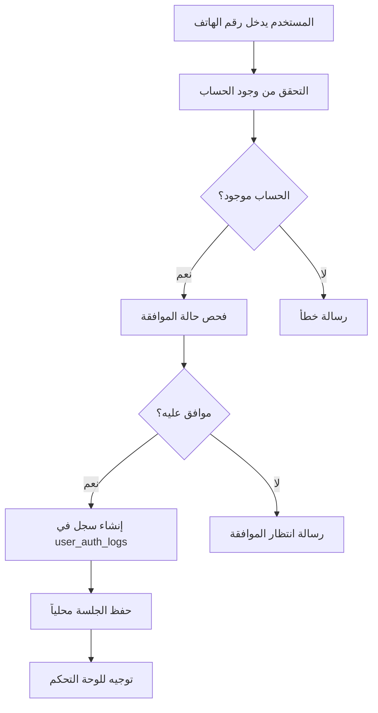
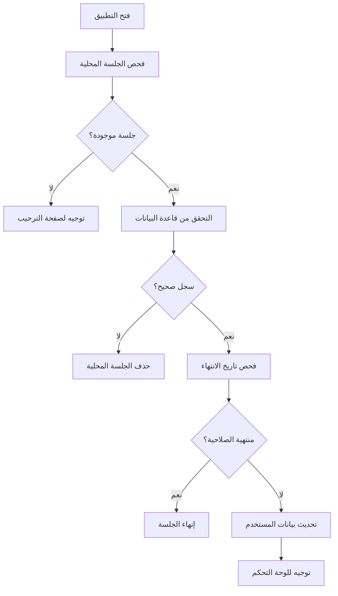
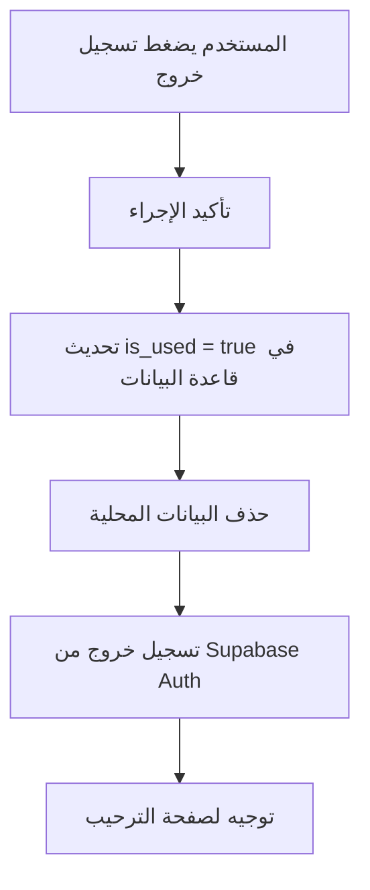

# نظام إدارة الجلسات المحسّن - ولكارد

## المقدمة

تم تطوير نظام إدارة جلسات محسّن يستخدم جدول `user_auth_logs` في قاعدة البيانات لضمان استمرارية الجلسة حتى يقوم المستخدم بتسجيل الخروج يدوياً.

## المكونات الرئيسية

### 1. Session Manager (`lib/session-manager.ts`)

#### الميزات:
- ✅ **جلسات مستمرة**: تبقى الجلسة نشطة لمدة 30 يوم
- ✅ **أمان عالي**: التحقق من صحة الجلسة مع قاعدة البيانات
- ✅ **تنظيف تلقائي**: إزالة الجلسات المنتهية الصلاحية
- ✅ **تحديث البيانات**: استرجاع بيانات المستخدم المحدثة
- ✅ **إدارة محلية ومركزية**: حفظ محلي + تتبع في قاعدة البيانات

#### الدوال الرئيسية:
```typescript
// إنشاء جلسة جديدة
createSession(user: UserData): Promise<UserSession>

// استرجاع الجلسة الحالية
getSession(): Promise<UserSession | null>

// تحديث وقت انتهاء الجلسة
refreshSession(): Promise<boolean>

// تسجيل خروج وإنهاء الجلسة
clearSession(): Promise<void>

// تنظيف الجلسات المنتهية
cleanupExpiredSessions(): Promise<void>
```

### 2. Auth Helpers (`lib/auth-helpers.ts`)

#### الدوال المساعدة:
```typescript
// تسجيل دخول المستخدم
loginUser(phoneNumber: string): Promise<LoginResult>

// فحص حالة تسجيل الدخول
checkLoginStatus(): Promise<LoginStatus>

// تسجيل خروج المستخدم
logoutUser(): Promise<boolean>

// تحديث معلومات الجلسة
updateSessionInfo(updates: Partial<UserSession>): Promise<boolean>

// الحصول على المستخدم الحالي
getCurrentUser(): UserSession | null
```

## كيفية عمل النظام

### 1. عند تسجيل الدخول:


### 2. عند فحص الجلسة:


### 3. عند تسجيل الخروج:


## هيكل قاعدة البيانات

### جدول `user_auth_logs`:
```sql
CREATE TABLE user_auth_logs (
    id UUID DEFAULT gen_random_uuid() PRIMARY KEY,
    user_id UUID REFERENCES users(id) ON DELETE CASCADE,
    expires_at TIMESTAMPTZ NOT NULL,
    created_at TIMESTAMPTZ DEFAULT NOW(),
    is_used BOOLEAN DEFAULT FALSE
);
```

### الحقول:
- **id**: معرف فريد للسجل
- **user_id**: معرف المستخدم
- **expires_at**: تاريخ انتهاء الجلسة (30 يوم من الإنشاء)
- **created_at**: تاريخ إنشاء الجلسة
- **is_used**: حالة الجلسة (false = نشطة، true = منتهية)

## الملفات المحدثة

### 1. `app/index.tsx`
- ✅ استخدام SessionManager بدلاً من Supabase Auth مباشرة
- ✅ فحص شامل لحالة الجلسة
- ✅ تنظيف الجلسات المنتهية

### 2. `app/store-owner/profile.tsx`
- ✅ استخدام `logoutUser()` للخروج
- ✅ تسجيل خروج محسّن

### 3. الملفات الجديدة:
- ✅ `lib/session-manager.ts` - إدارة الجلسات الأساسية
- ✅ `lib/auth-helpers.ts` - دوال مساعدة للمصادقة

## المزايا

### 1. **أمان محسّن**:
- التحقق من قاعدة البيانات في كل مرة
- تتبع جميع الجلسات النشطة
- إمكانية إنهاء الجلسات من المشرف

### 2. **أداء أفضل**:
- حفظ محلي للاستجابة السريعة
- تحديث البيانات عند الحاجة فقط
- تنظيف تلقائي للجلسات المنتهية

### 3. **تجربة مستخدم أفضل**:
- عدم فقدان الجلسة عند إغلاق التطبيق
- تسجيل دخول تلقائي عند العودة
- رسائل واضحة للحالات المختلفة

### 4. **سهولة الصيانة**:
- كود منظم ومفصول
- دوال مساعدة واضحة
- توثيق شامل

## كيفية الاستخدام

### للمطورين:

#### تسجيل دخول مستخدم:
```typescript
import { loginUser } from '@/lib/auth-helpers';

const result = await loginUser(phoneNumber);
if (result.success) {
  // توجيه للوحة التحكم
  router.push(getRedirectPath(result.session.user_type));
} else {
  // عرض رسالة خطأ
  Alert.alert('خطأ', result.error);
}
```

#### فحص حالة تسجيل الدخول:
```typescript
import { checkLoginStatus } from '@/lib/auth-helpers';

const status = await checkLoginStatus();
if (status.isLoggedIn) {
  router.push(status.redirectTo);
} else {
  router.push('/onboarding/welcome');
}
```

#### تسجيل خروج:
```typescript
import { logoutUser } from '@/lib/auth-helpers';

const success = await logoutUser();
if (success) {
  router.replace('/onboarding/welcome');
}
```

#### الحصول على المستخدم الحالي:
```typescript
import { getCurrentUser } from '@/lib/auth-helpers';

const currentUser = getCurrentUser();
if (currentUser) {
  console.log('Current user:', currentUser.full_name);
}
```

## الصيانة والتنظيف

### تنظيف الجلسات المنتهية:
```typescript
import { sessionManager } from '@/lib/session-manager';

// يمكن تشغيلها دورياً
await sessionManager.cleanupExpiredSessions();
```

### مراقبة الجلسات:
```sql
-- عرض جميع الجلسات النشطة
SELECT 
    ual.id,
    u.full_name,
    u.phone_number,
    ual.created_at,
    ual.expires_at
FROM user_auth_logs ual
JOIN users u ON ual.user_id = u.id
WHERE ual.is_used = false
ORDER BY ual.created_at DESC;
```

## المستقبل

### تحسينات مخططة:
- ✅ إضافة إشعارات انتهاء الجلسة
- ✅ إمكانية تسجيل دخول من أجهزة متعددة
- ✅ تتبع نشاط المستخدم
- ✅ لوحة تحكم المشرف لإدارة الجلسات 